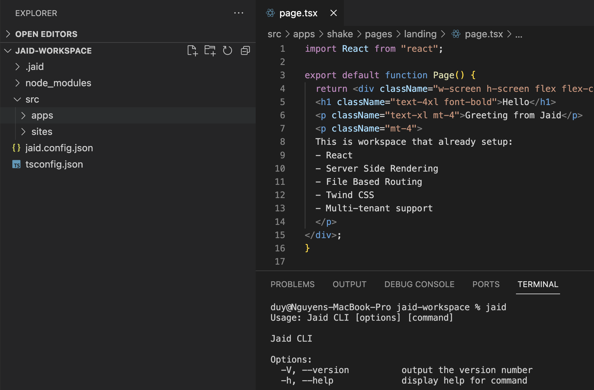

# 🚀 Jaid

> :warning: **Under Development**: This project is under active development. Features and documentation may change.

Jaid is an innovative CLI tool designed for developers looking to leverage React, Server-Side Rendering (SSR), and multi-tenant capabilities with ease. It not only streamlines the process of setting up modern web applications but also enables developers to create and publish applications within the Jaidee framework to the Jaidee ecosystem, fostering a community-driven platform.

## 🖼️ Preview


## 📦 Installation

Ensure Node.js and Yarn are installed on your machine before beginning. Install Jaid globally using Yarn for easy access to its powerful features:

```bash
yarn global add jaid
```

## 🛠️ Getting Started

Jaid simplifies the development process, allowing you to focus on building rather than configuration. Here's how to get started:

1. **Install CLI**

    Install Jaid globally to begin creating projects tailored for the Jaidee ecosystem:

    ```bash
    yarn global add jaid
    ```

2. **Create a New Project**

    Use Jaid to scaffold a new project, setting up all necessary dependencies and configurations for React and SSR:

    ```bash
    jaid mkproj
    ```

3. **Navigate to Your Project**

    Move into your project's directory to start developing:

    ```bash
    cd your-project-name
    ```

4. **Link Dependencies**

    Before further development, ensure all dependencies are correctly linked:

    ```bash
    jaid setup
    ```

5. **Create and Publish an App**

    Jaid not only allows you to create apps for personal and commercial use but also enables you to contribute to the Jaidee ecosystem by publishing your applications:

    ```bash
    jaid new-app <app-name>
    ```

    

## 🔌 Jaid Ecosystem

Developing with Jaid means you're part of a larger ecosystem. The Jaidee framework encourages sharing, collaboration, and the use of community-driven applications. When you're ready, publish your application to the Jaidee ecosystem to be used by others, enhancing the collective capabilities of developers worldwide.

## 🌟 Features

- **Fast Setup**: Get up and running with React, SSR, and multi-tenant architectures quickly.
- **Ecosystem Integration**: Seamlessly create and publish apps within the Jaidee framework.
- **Community-Driven**: Join a growing community, contributing to a diverse ecosystem of applications.

## 🤝 Contributing

Contributions are what make the Jaidee ecosystem thrive. We welcome any contributions you would like to make. Please refer to the contributing guide for more information.

## 📝 License

Jaid is open-source software licensed under the MIT license.
